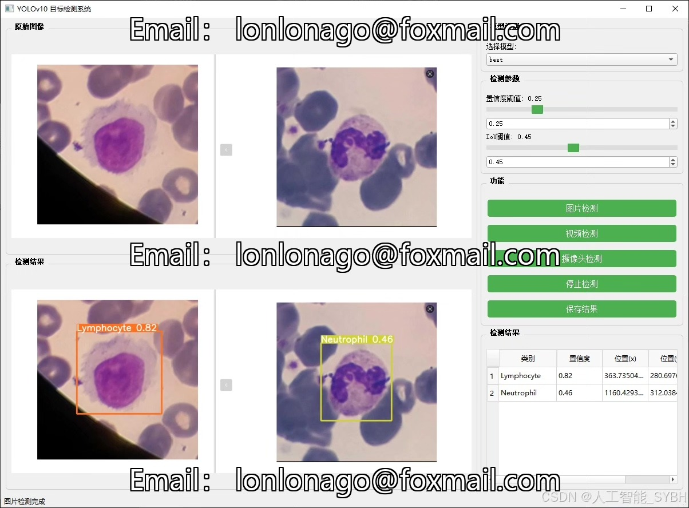
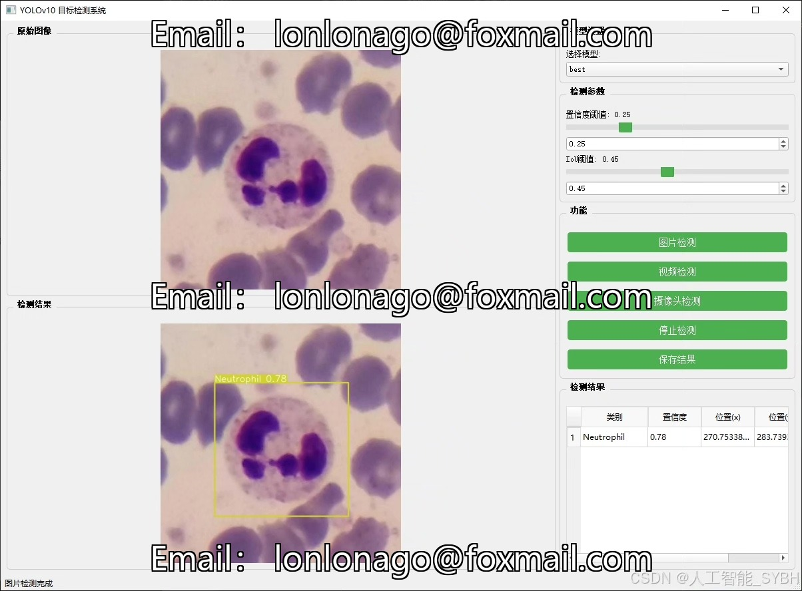
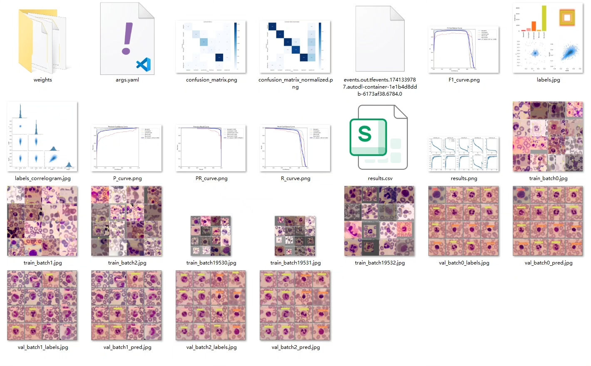
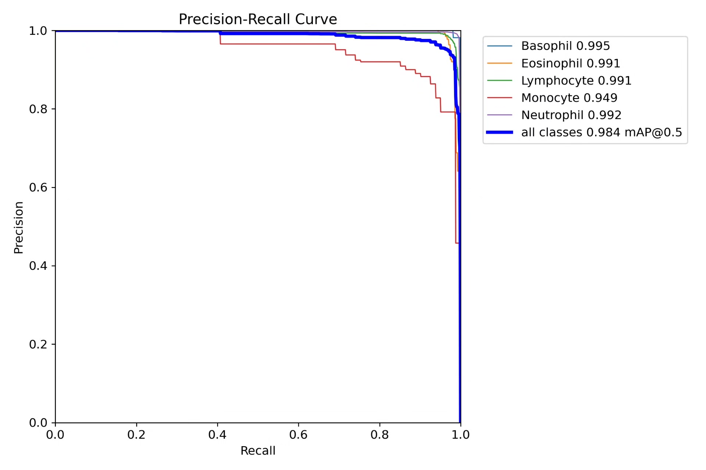
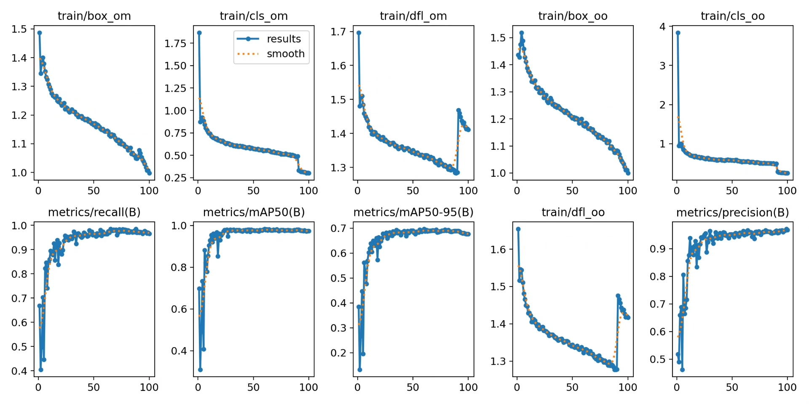
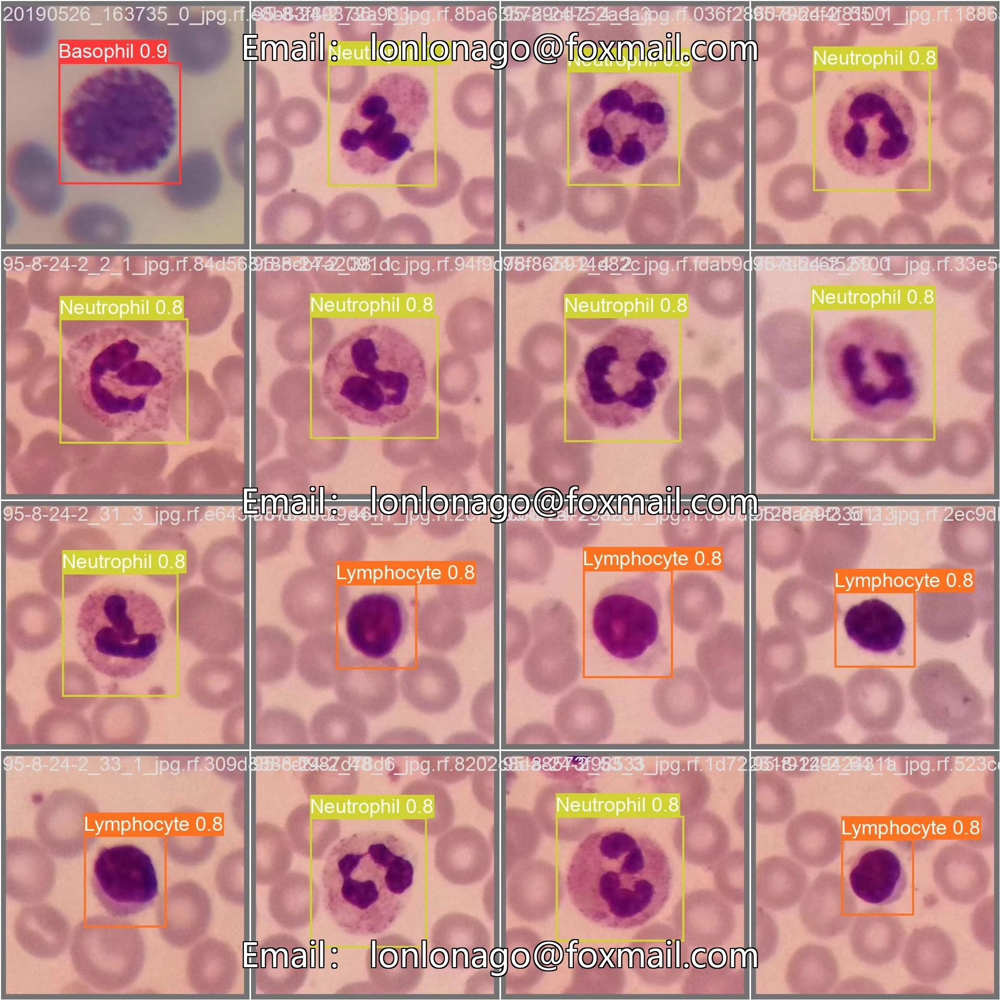
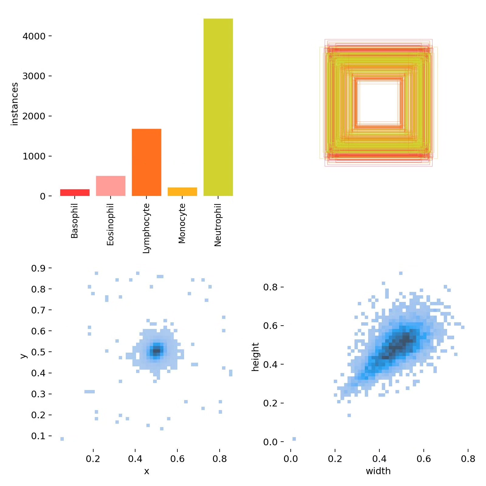
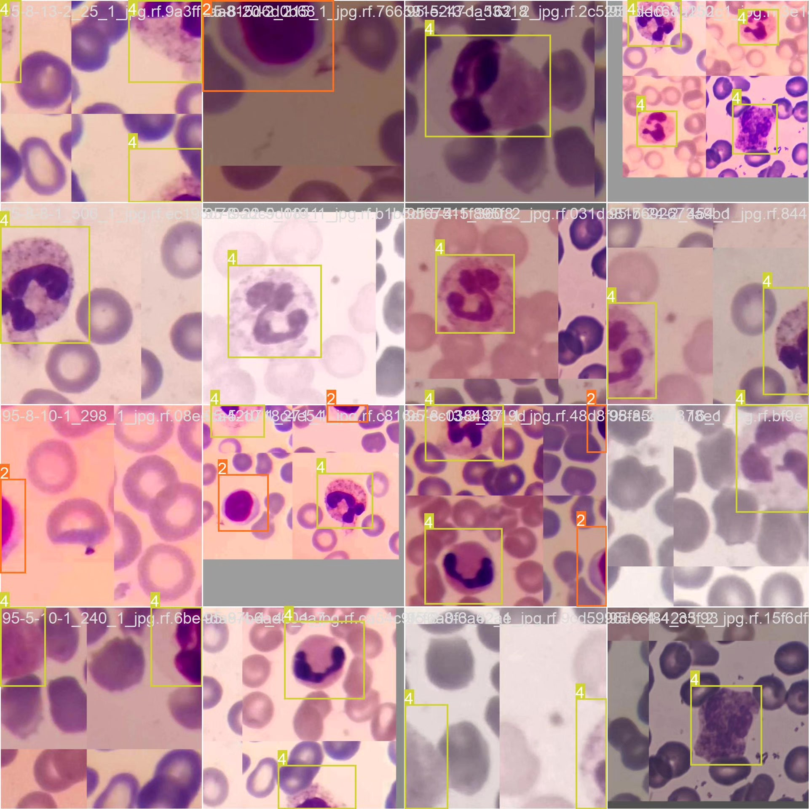

# Based on deep learning YOLOv10 for leukocyte type detection system (YOLOv1)

## Body

Based on the YOLOv10 object detection algorithm, this project has developed a system for automatic classification of leukocyte types in peripheral blood smears. It can identify and classify five main leukocyte types: Basophils, Eosinophils, Lymphocytes, Monocytes, and Neutrophils.

The company's products have obtained the official commercial license certification from YOLO.

We provide after-sales service.

After payment, we will provide WeChat IDs to answer questions anytime.

Environmental configuration: We will provide an instruction tutorial for environmental configuration, and WeChat will provide answers.

Remote installation services: If you need remote configuration, an additional fee of 69 is required. If the configuration fails, all fees will be refunded (specially for old computers only refund installation fees).

Retraining dataset: After setting up the environment, you can train on your own computer. If you need us to retrain, just pay 69 plus computing power fees (2.5 yuan/hour).

Full after-sales service

## Images

## Payment

Here is a pay link on Stripe ( https://buy.stripe.com/3cs8yP7sY87d0vu9AB ). Please contact me lonlonago@foxmail.com after funding $89, and I will send you a complete data files , thank you!

